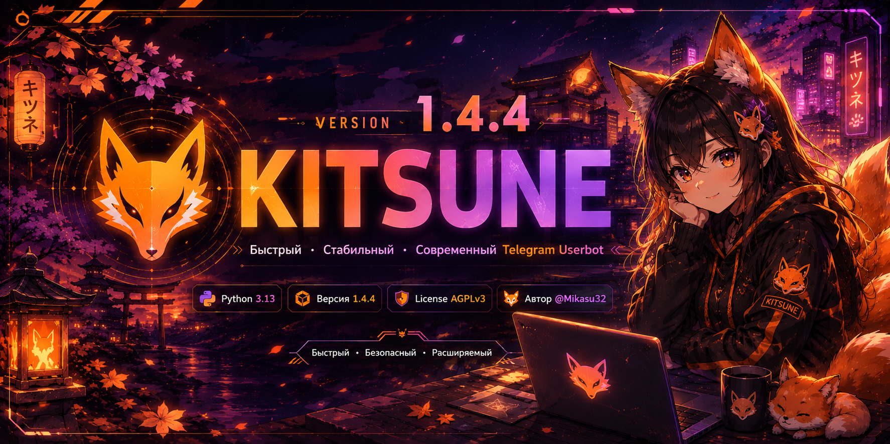

<div align="center">



<br/>

[](https://python.org)
[](https://github.com/KitsuneX-dev/Kitsune/releases/tag/v1.4.4)
[](LICENSE)
[](https://t.me/Mikasu32)

*Быстрый · Безопасный · Расширяемый*

</div>

---

## 🦊 Что это такое

Kitsune — Telegram-юзербот, который живёт на твоём устройстве, а не в чужом облаке.
Телефон на Termux, домашний сервер, VPS, ноутбук под WSL — везде один и тот же
установщик и одна и та же панель управления в браузере.

Под капотом два клиентских стека: **Telethon** тянет всю логику команд, **Hydrogram**
подхватывает тяжёлые медиа. Модули проходят проверку на опасный код ещё до запуска
(это дополнительный защитный слой, а не песочница), а бэкапы уезжают в Telegram
по расписанию — чтобы «я всё потерял» не случилось в три часа ночи.

> **Модули от Hikka и Heroku не заведутся.** У них другой API и другая модель
> загрузчика — совместимость сломала бы половину гарантий безопасности Kitsune.
> Своя библиотека модулей в работе.

---

## ✨ Чем интересен

| | Функция | Что это даёт |
|:---:|---|---|
| ⚡ | Скорость | Команды и тяжёлые медиа работают быстро |
| 🔒 | Проверка модулей | Опасный код отсеивается **до** запуска |
| 🛡️ | Rate limiter | Token-bucket против флуд-бана |
| 💾 | Надёжность | Данные не теряются при внезапном падении |
| 🤖 | aiogram 3.x | Служебный бот для уведомлений и бэкапов |
| 📦 | Авто-бэкап | По расписанию, прямо в Telegram |
| 🌐 | Веб-панель | Модули, настройки, логи, ресурсы, доп.аккаунты |
| 👥 | Доп.аккаунты | До 3 твинков на одном хосте, полностью изолированно |
| 📋 | TOML-конфиг | Читаемый файл с поддержкой прокси |
| 📱 | Мультиплатформа | Termux, Ubuntu, Debian, UserLand, Docker, WSL |

---

## 📋 Что нужно до старта

- **Python 3.13**
- API-ключи с [my.telegram.org/apps](https://my.telegram.org/apps)
- VPN или SOCKS5-прокси — **обязательно для пользователей из РФ** *(подробности ниже)*

---

## 🚀 Установка

**Termux (Android)**
```bash
curl -s https://raw.githubusercontent.com/KitsuneX-dev/Kitsune/main/termux.sh | bash
```

**Ubuntu / Debian / UserLand**
```bash
curl -s https://raw.githubusercontent.com/KitsuneX-dev/Kitsune/main/install.sh | bash
```

**Вручную**
```bash
git clone https://github.com/KitsuneX-dev/Kitsune
cd Kitsune
python3 -m venv venv && source venv/bin/activate
pip install -r requirements.txt
python -m kitsune
```

**Docker**
```bash
git clone https://github.com/KitsuneX-dev/Kitsune
cd Kitsune
docker compose run --rm kitsune     # первый запуск: ввод api_id/api_hash и кода
docker compose up -d                # дальше — в фоне
```

Все данные (сессия, БД, ключи, `config.toml`) лежат в томе `kitsune-data`,
смонтированном в `/data`, и переживают пересоздание контейнера. Состояние
проверяется через `/health`: `docker compose ps` показывает `healthy`.

> Порт 8080 уже занят? Пропиши другой в `config.toml` → `web_port = 8081`.
> В Docker конфиг находится внутри тома — `/data/config.toml`.

---

## ▶️ Запуск

```bash
# Termux / UserLand
python -m kitsune

# Ubuntu / Debian (venv)
source venv/bin/activate && python -m kitsune

# либо без активации окружения
venv/bin/python -m kitsune
```

После старта Kitsune пришлёт в «Избранное» ссылку на веб-панель вместе с
токеном доступа — вида `http://127.0.0.1:8080/?token=...`. Это обзор ресурсов,
управление модулями, настройки, логи и доп.аккаунты. Без токена панель отдаёт
`401` — подробности в разделе [«Безопасность»](#-безопасность).

При обновлении поверх 1.4.3 запуск автоматически удаляет только известные
устаревшие исходники (`core/loader.py`, `inline/core.py`, `modules/backup.py`,
старый `utils.py` и удалённые secure-хелперы). Конфиг, сессии, БД и пользовательские
модули не затрагиваются. Рабочая обработка команд подтверждается строкой
`Telethon update loop started` в журнале; до неё модули могут быть загружены,
но Telegram-события ещё не принимаются.

---

## 🌐 Прокси и VPN

> 🚨 **Из России без VPN или рабочего прокси бот просто не поднимется** — Telegram
> режется на уровне провайдера.

**Вариант 1 — VPN (проще всего).** Включи перед запуском. Сменился IP — Kitsune
переподключится сам.

**Вариант 2 — MTProxy + SOCKS5.** Оба прокси работают одновременно:

- Inline-кнопки не нужны → хватит одного MTProxy ([@MTProxyT](https://t.me/MTProxyT), [@proxyme](https://t.me/proxyme)).
- Inline-кнопки нужны → нужны **оба**: MTProxy и SOCKS5. Живой бесплатный SOCKS5
  найти тяжело, так что либо платный, либо всё-таки VPN.

```toml
[proxy]
type   = "MTPROTO"
host   = "АДРЕС_ПРОКСИ"
port   = 443
secret = "СЕКРЕТ_ПРОКСИ"

[proxy_socks5]
host     = "АДРЕС_ПРОКСИ"
port     = 1080
username = "USER"
password = "PASS"
```

---

## ⚙️ Конфигурация

`config.toml` создаётся сам при первом запуске (`~/Kitsune/config.toml`):

```toml
api_id   = 123456
api_hash = "abcdef..."
prefix   = "."
lang     = "ru"
web_host = "127.0.0.1"
web_port = 8080
low_power = false

[proxy]
type   = "MTPROTO"
host   = "127.0.0.1"
port   = 443
secret = "00000000000000000000000000000000"
```

### Переменные окружения

| Переменная | Назначение |
|------------|-----------|
| `KITSUNE_DATA_DIR` | Каталог данных (сессия, БД, ключи, конфиг). Высший приоритет |
| `KITSUNE_CONFIG` | Явный путь к `config.toml` |
| `DOCKER` | `1` → каталог данных по умолчанию `/data` |
| `KITSUNE_LOW_POWER` | `1` → режим экономии ресурсов (приоритет над `low_power` в конфиге) |

Приоритет каталога данных: `KITSUNE_DATA_DIR` → `/data` (в Docker) →
`~/.kitsune`.

### 🔋 Режим экономии ресурсов (`low_power`)

Для слабых устройств — Termux на старом телефоне, VPS с 256 МБ RAM,
Raspberry Pi. Включается через `low_power = true` в `config.toml` или
переменной окружения `KITSUNE_LOW_POWER=1` (она имеет высший приоритет).

Что меняется при `low_power = true`:

| Параметр | По умолчанию | В `low_power` |
|----------|--------------|---------------|
| Задержка записи БД | `0.2` с | `1.5` с |
| Hydrogram (второй клиент) | включён | **выключен** |
| Веб-панель | включена | **выключена** |
| Повторы подключения / задержка | `10` / `3` с | `3` / `1` с |

Реже пишем на диск — меньше износ флеш-памяти и нагрузка на I/O; без
Hydrogram и веб-панели экономится ощутимая часть RAM.

**Точечный оверрайд.** Если нужен режим экономии, но с каким-то из
отключённых компонентов — включи его явно в `config.toml`, явная настройка
пользователя имеет приоритет:

```toml
low_power = true
hydrogram = true   # low_power включён, но Hydrogram всё равно стартует
web       = true   # то же самое для веб-панели
```

Задержку записи БД можно подстроить ключом `low_power_save_delay`
(значение клэмпится в диапазон `1.0`–`2.0` с):

```toml
low_power = true
low_power_save_delay = 2.0
```

На Termux и UserLand установщик включает `low_power = true` автоматически.

**UserLand.** Установщик уже переводит временные файлы в `$HOME/tmp`, чтобы
работа на этой платформе шла быстрее.

---

## 🔐 Безопасность

**Веб-панель закрыта токеном.** При первом запуске генерируется криптостойкий
токен; он пишется в лог и приходит в «Избранное» вместе со ссылкой вида
`http://127.0.0.1:8080/?token=...`. По этой ссылке токен кладётся в
httpOnly-cookie, дальше панель работает как обычно. Запросы к API можно слать
и напрямую — заголовком `Authorization: Bearer <токен>`. Без токена любой
роут, кроме `/health`, отвечает `401`; после 10 неудачных попыток за минуту IP
блокируется на 5 минут.

**По умолчанию панель слушает только `127.0.0.1`** — из внешней сети она
недоступна. Это же касается мастера первичной настройки, через который вводится
код входа и облачный пароль.

**Если панель нужна снаружи** — открывай её осознанно. Рекомендуемый способ —
SSH-туннель, при нём ничего менять в конфиге не надо:

```bash
ssh -L 8080:127.0.0.1:8080 user@сервер
```

Прямой биндинг (`web_host = "0.0.0.0"` в `config.toml`) — только если понимаешь
риск: в лог уйдёт предупреждение, а токен станет единственной преградой между
твоим аккаунтом и сетью. Ставь его за reverse-proxy с HTTPS и никому не
показывай ссылку с токеном.

**Про модули.** Каждый модуль перед запуском проходит статическую проверку на
опасный код. Это **дополнительный защитный слой**, а не песочница и не
стопроцентная гарантия: очевидно вредоносные конструкции отсеиваются, но чужие
модули всё равно стоит проверять самому и ставить только из доверенных источников.

**Прочее:** файлы сессии, ключи и каталог данных закрыты от других пользователей
на этом устройстве, а бэкапы уезжают в Telegram уже зашифрованными.

---

## 🎨 Свой текст в `.info` и `.ping`

Сообщения `.info` и `.ping` можно переписать под себя — включая премиум-эмодзи.
Задаётся через `.setinfo` (или конфиг модуля), сбрасывается через `.resetinfo`.

Доступные плейсхолдеры:

| Плейсхолдер | Что подставит | Пример |
|---|---|---|
| `{me}` | Ссылка на владельца | `Yushi` |
| `{version}` · `{build}` · `{branch}` | Версия, коммит, ветка | `1.4.4` · `a1b2c3d` · `main` |
| `{upd}` | Метка «доступно обновление» | `⬆️ Доступно обновление` |
| `{prefix}` | Текущий префикс команд | `«.»` |
| `{uptime}` | Сколько бот живёт | `2д 4ч 17м` |
| `{platform}` | Короткая подпись хоста | `🐧 Linux` |
| `{os}` | Дистрибутив из `/etc/os-release` | `Ubuntu 24.04.1 LTS` |
| `{kernel}` | Версия ядра | `6.8.0-45-generic` |
| `{hostname}` · `{user}` | Хост и пользователь | `fox-server` · `yushi` |
| `{cpu}` | Модель CPU и ядра | `AMD Ryzen 5 5600; 6 (12) core(-s)` |
| `{cpu_usage}` · `{ram_usage}` | Текущая нагрузка | `11.9%` · `2048 MB` |
| `{env}` | Среда запуска | `📱 Termux`, `🐳 Docker`, `🪟 WSL (Ubuntu)` |
| `{ping}` | Реальный отклик Telegram, мс (только `.info`) | `62` |

В `.ping` доступен тот же набор плюс `{ms}` — там задержка меряется отдельно.
Если какое-то значение недоступно на твоей системе, вместо него подставится `—`,
а сообщение всё равно уйдёт.

---

## 👥 Доп.аккаунты (твинки)

Kitsune умеет держать до **3 дополнительных Telegram-аккаунтов** на том же хосте —
второй телефон не нужен. Всё делается из веб-панели, вкладка **«Доп.аккаунты»**.

### ⚠️ Прочитай до того, как подключишь

- **Ответственности за твинк никто не несёт.** Telegram официально против
  юзер-ботов. Аккаунт могут ограничить, заморозить или снести — это твой риск.
  Не подключай аккаунты, потеря которых будет болезненной.
- **Память.** Каждый твинк — это отдельный процесс (Telethon + Hydrogram).
  Нужно **минимум 4 ГБ ОЗУ на один твинк**; при 8 ГБ и трёх твинках плюс основной
  аккаунт память будет впритык. Следи за нагрузкой во вкладке «Обзор» — там теперь
  видно и потребление самого Kitsune, и системное.

### Как подключить

1. Веб-панель → **«Доп.аккаунты»** → **«Добавить доп.аккаунт»**, задай имя.
2. Введи **API-ID**, **API-HASH** и номер телефона твинка.
3. Введи код из Telegram (этап Telethon), при 2FA — облачный пароль.
4. Введи код ещё раз для этапа Hydrogram (при 2FA — снова пароль).
5. Готово, аккаунт запущен.

Дальше в списке у каждого твинка есть переключатель «вкл/выкл» и кнопка удаления
(она останавливает процесс и стирает папку целиком — отменить нельзя).

### Изоляция

Каждый твинк живёт в своей отдельной папке со своими настройками, сессией, базой
и модулями, поэтому твинки не мешают друг другу и основному аккаунту. Вручную
ничего настраивать не нужно — всё делает веб-панель.

---

## 💾 Бэкапы

При первом запуске Kitsune спросит интервал авто-бэкапа: **2ч / 4ч / 6ч / 12ч / 24ч**.
Архивы уходят в группу **KitsuneBackup** через служебного бота. Чтобы
восстановиться — ответь на файл бэкапа командой `.restore`.

---

## ⚠️ Отказ от ответственности

Проект предоставляется **«как есть»**, без каких-либо гарантий. Разработчик
**не несёт никакой ответственности** за любые проблемы, вызванные использованием
юзербота. Устанавливая Kitsune, ты принимаешь **весь риск на себя**. В частности
(но не только):

- блокировка, ограничение или удаление аккаунта со стороны Telegram;
- удаление сообщений алгоритмами Telegram;
- вредоносные модули (SCAM-модули) и утечка сессии из-за них;
- любые действия, которые твой аккаунт совершит в фоне в целях автоматизации.

Разумный минимум безопасности:

- включи защиту от флуда через `.api_fw_protection`;
- не устанавливай много модулей разом;
- ставь модули только из источников, которым доверяешь;
- используя Kitsune, ты соглашаешься на фоновые действия аккаунта в целях
  автоматизации;
- обязательно прочитай [Telegram TOS](https://core.telegram.org/api/terms).

---

## 📄 Лицензия

AGPLv3 © Yushi ([@Mikasu32](https://t.me/Mikasu32)), 2024–2026
